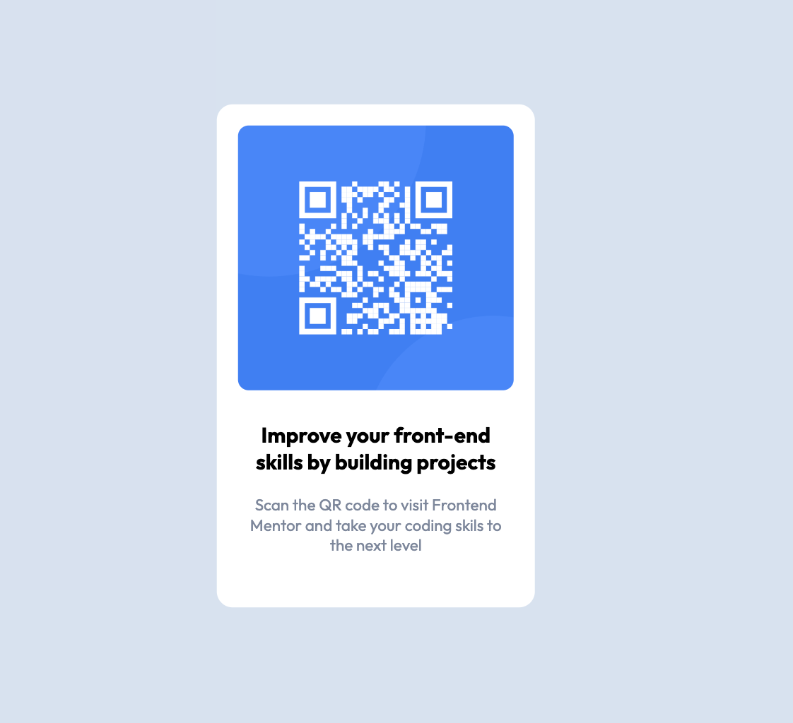

# Frontend Mentor - QR code component solution

This is a solution to the [QR code component challenge on Frontend Mentor](https://www.frontendmentor.io/challenges/qr-code-component-iux_sIO_H). Frontend Mentor challenges help you improve your coding skills by building realistic projects.

## Table of contents

- [Overview](#overview)
  - [Screenshot](#screenshot)
  - [Links](#links)
- [My process](#my-process)
  - [Built with](#built-with)
  - [What I learned](#what-i-learned)
- [Author](#author)

## Overview

### Screenshot

### Links

- Solution URL: [GitHub](https://github.com/maliabadziukh/qr-code-component)
- Live Site URL: [GitHub Pages](https://maliabadziukh.github.io/qr-code-component/)

## My process

First I analysed the challenge picture and broke it down into boxes. I then wrote the HTML to match my breakdown and build up the styling bit by bit.

### Built with

- Vanilla HTML and CSS

### What I learned

I already knew all of the CSS properties I used but did not have much practice with flexbox. It was great to dive into how i can replicate a design by using is as the main layout tool.

## Author

- Frontend Mentor - [@maliabadziukh](https://www.frontendmentor.io/profile/maliabadziukh)
